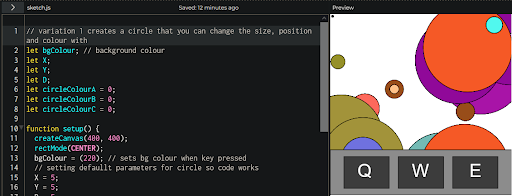
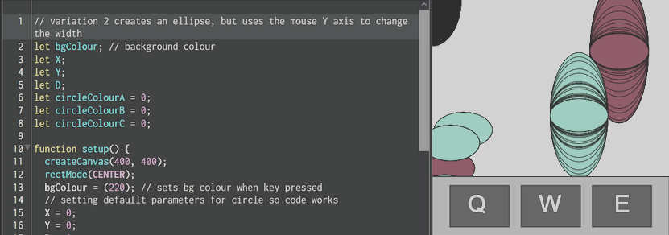
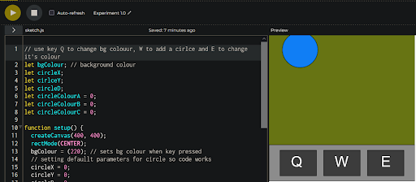

# Experiment 1
## Experiment 1:
For this experiment, I chose the control panel because I liked the idea of creating an interface that the user could see and instantly know the controls to use.

[Link to experiment 1 web](/code/Experiment-1-code/index.html)

Above is the finished P5 project for the first experiment. I created the UI to replicate part of the keyboard, display the keys Q, W, and E. This is how the user operates the effects. This program changes the background colour with one key, creates a circle in a random position with W, and then changes its colour with E. The main challenge I faced was creating the interface; it required a lot of trial and error to line up the shapes properly. Each program uses a key-press function, which is the main technique I utilised here in each iteration.

Link to program on p5: https://editor.p5js.org/w1ll-cmd/sketches/M23qsyxY2

## Iteration 1:

[Link to experiment 1, iteration 1 on the web](/code/Experiment-1-itr-1-code/index.html)

Above is the first iteration of the main program. Here, I changed the background effects and focused on just the circle. I made circles, not reset every time a new one is drawn. Next, I changed the keys so that one changes the position, another changes the colour, and the other changes the size.

Iteration 1 on p5: https://editor.p5js.org/w1ll-cmd/sketches/cCCXOkFOP

## Iteration 2:

[Link to experiment 1, iteration 2 on the web](/code/Experiment-1-itr-2-code/index.html)

Above is iteration 2. Here, I changed the shape to an ellipse to give the user more customisability over the shape's parameters. So the main difference here is that I use the mouse Y axis to change the height, which produces these really cool-looking effects.

Iteration 2 on p5: https://editor.p5js.org/w1ll-cmd/sketches/Ceml4kKcU
