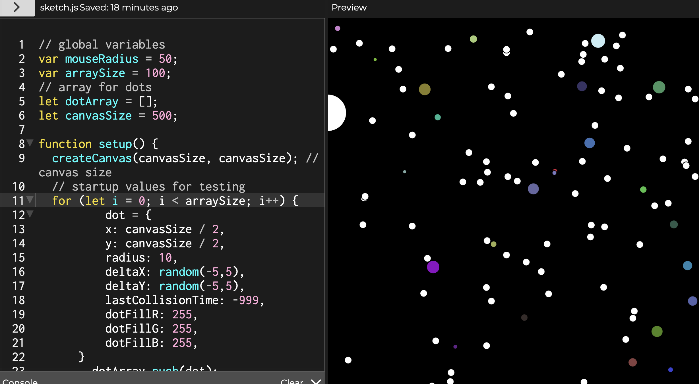
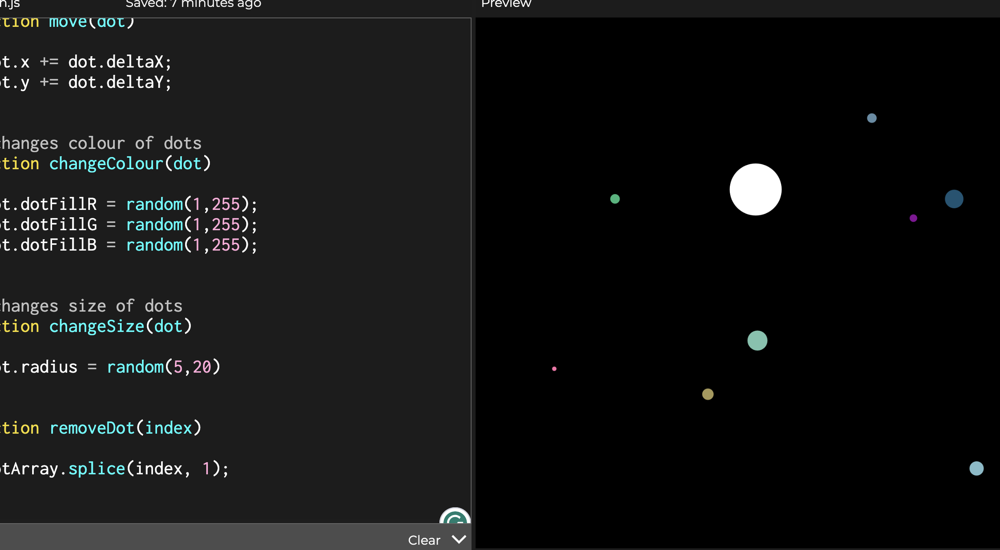
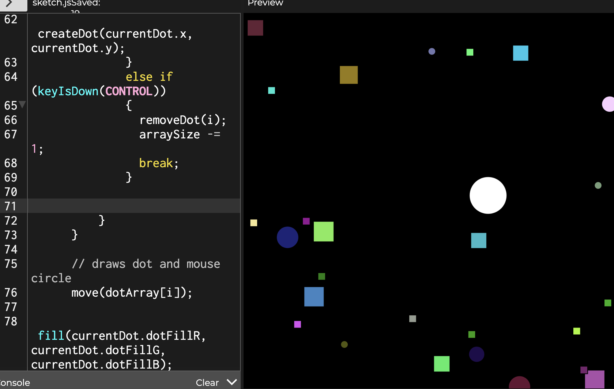

# Experiment 2

In this second experiment, I chose the mouse disturber. I chose this because I really wanted to dive into the code behind making shapes bounce off objects, and this could be the perfect way to try it out.

[Link to experiment 2 web](/code/Experiment-2-code/index.html)

I started my first experiment in multiple stages. I first tried to make small circles called 'dots' bounce off a circle that follows the mouse, which is the 'disturber'. Then, after this, I created an array to store these dots, so that I could have lots of them that are affected by the mouse circle. Finally, I then added in two more behaviours, where the small dots change their size and colour when they bounce off the mouse circle, making an interesting effect.

## Iteration 1

(Hold down 'shift' to split dots and 'control' to remove them)

For my first Iteration, I decided that I wanted to give the user the ability to create and remove these dots when pressing key commands. This required two new functions that carried out this and the use of built-in commands in p5, like KEYPRESS, for when a key is pressed down.

[Link to experiment 1, iteration 1 web](/code/Experiment-1-itr-1-code/index.html)

## Iteration 2

(Hold down 'shift' to split dots and 'control' to remove them)

For my final iteration, I decided that I wanted to explore how I would change the shape of my dots with code. To do this, I create a random number, and if that number is either 1 or 2, a function is called and then draws the corresponding shape of either a circle or a square. I originally wanted to implement triangles and ellipses as well, but realised my collisions would then not work properly since they aren't drawn from the centre point, making the collisions seem off. Overall, though I'm really happy with how this experiment came out, as it required me to think hard about how I would make these systems in my programs work.

[Link to experiment 1, iteration 2 web](/code/Experiment-1-itr-2-code/index.html)

