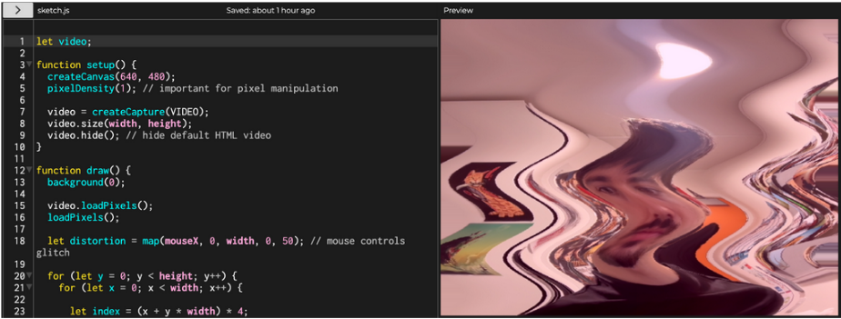
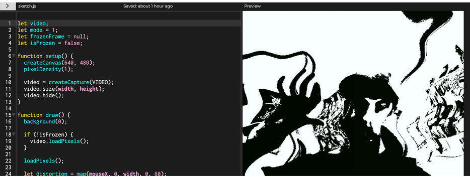
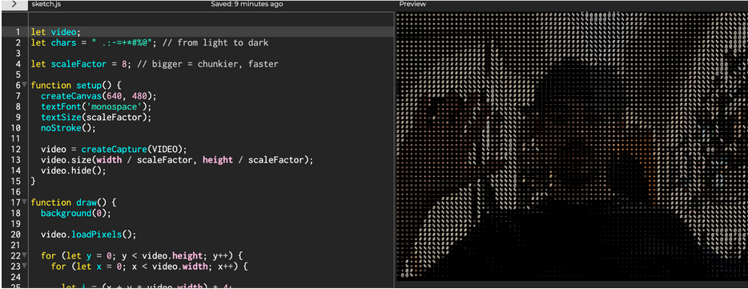
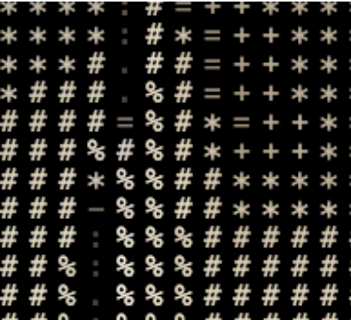

# Experiment 3

In this third experiment, I utilise AI to help me create some really good-looking effects in p5. I chose the webcam brief as I had some good ideas I wanted to try and implement using AI, and I think it can also be really fun to make use of the webcam on my laptop.

[Link to experiment 1](/code/Experiment-3-code/index.html)

Above is the first, main program I created using ChatGPT. This is a distortion effect where, as you move the mouse to the right on the screen, the level of distortion increases, and it moves dynamically, which looks really smooth. I made sure to give AI lots of context and specifics so that it could create my idea with accuracy without much hallucination.

## Iteration 1:

Above is the first iteration of the main program. Here, I asked ChatGPT to give me controls to create interesting effects with the webcam. They change the colours and bloom effects, which was really fun to experiment with. I had an issue where the program was too much for p5 (or my laptop), and so I asked the AI model to simplify the code and optimise it for better performance.

[Link to iteration 1 web](/code/Experiment-3-code-itr-1/index.html)

## Iteration 2

This final iteration was where I had the most fun. I didn't think it was possible, but AI suggested that I could use text symbols to mirror the webcam footage. This was really cool, and it was a lot less code than I thought it would be. Only 41 lines.

[Link to iteration 2 web](/code/Experiment-3-code-itr-2/index.html)
